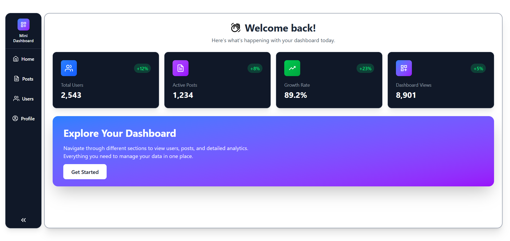

# 🚀 Mini Dashboard

A mini dashboard built with **Next.js 15, TypeScript, Tailwind CSS, and Framer Motion**.

---

## 🗂️ Routes & Features

### `/` → Dashboard Home  
  
Static summary section with welcome text & a small animated element (chart and card).

---

### `/posts` → Posts Page  
  
Fetch posts from **JSONPlaceholder** and display them in reusable Card components.  

---

### `/posts/[id]` → Post Details Page  
  
Fetch and display details of a single post.  

---

### `/users` → Users Page  

Fetch users from **JSONPlaceholder**. Show them in a responsive table. Click the row to open an animated modal with user details.  

---
